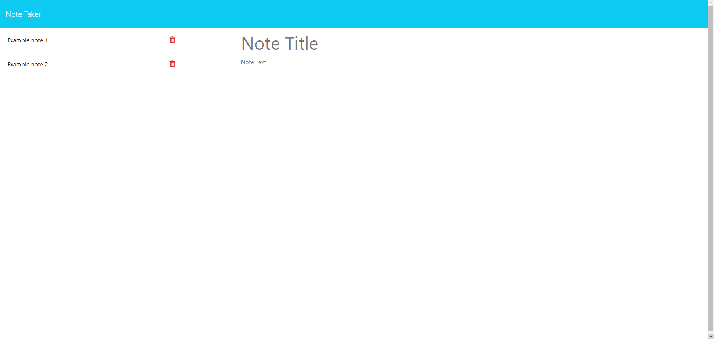

# Note-Taker-Application

## Description

This project was completed for the Columbia Coding Bootcamp. The purpose of this project was to add server-side functionality to a note taker application. This involves a database of saved notes, as well as the ability to re-visit past notes and delete them if needed. I used Render for server-side implementation because GitHub Pages does not have that functionality.

## Installation

N/A

## Usage

This project can be accessed on Git Pages at the following URL: [https://boamarant.github.io/Module-3-Challenge/](https://boamarant.github.io/Module-3-Challenge/).

## Credits

I referenced previous projects and examples from the Columbia University Coding Bootcamp to assist in creating this page. ChatGPT helped me work through bugs that I was having. 

## Features

The application allows users to enter notes and a description of a note. When the note has both a title and description, the user is allowed to add it to their list of notes. Users can revisit notes they have already created, as well as delete them as they see fit. 

## Screenshot of Deployed Application

